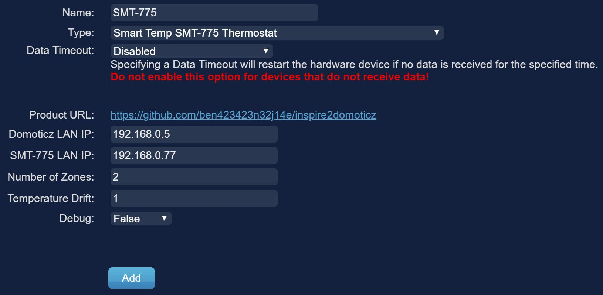

# inspire2domoticz
A Domoticz plugin to control the Smart Temp SMT-775 Inspire Thermostat
 
 
WARNING <<<<<<<, the company appears to have made a change to the thermostats software. Attempts to work with the company to find a way to continue accessing the thermostat have been unsuccessful.

When attempting to get the temperature from the thermostat, I just get the message:

I've removed the MAC address and changed the encrypt key a bit in the below example of the output I am receiving:

{"mac":"REMOVED","dev_type":775,"dev_ver":1,"encrypt":"0e9a778a1c16ac00c6355340d596e3ba"}

Attempts to control the thermostat appear to be ignored (I assume it now requires whatever encryption mechanism that has been introduced).

 
<B>Instructions:</B>
 
 
1) Install [Domoticz](https://www.domoticz.com/) (if not already installed)
 
   
2) Install the latest version of [Python](https://www.python.org/downloads/)
 
 
3) Find the Domoticz install files on your system (look in program files if using Windows) and go into the plugins folder (create if it doesn't exist).
 
 
4) Create a new folder inside the plugins folder called smt775 then download the plugin.py file and place it inside.
 
 
5) Start or restart Domoticz if you already have it running, go to "Setup > Hardware", you should see "Smart Temp SMT-775 Thermostat" in the "Type:" dropdown box at the bottom of the page. Select it and fill out the fields to configure.
 
 

<B>Configuring the plugin:</B>
* "Domoticz Lan IP" is the static IP address you have given your computer that is running Domoticz
* "SMT-775 Lan IP" is the static IP address you have given the SMT-775 either by setting a static IP on the unit or by using the DHCP settings on your router.
* "Number of Zones" is how many seperate air conditioning zones you have (you can find this out by looking in Zones on the SMT-775 physical screen.
* "Temperature Drift" is how far the thermostat should allow the temperature to vary from your set temperature, the default is 1 degree either above or below your setpoint.

It was nessesary to combine the cool and heat setpoints into a single temperature with a "Drift" allowance in order to accomodate home automation appliances such as Amazon Alexa, eg: "Alexa set the thermostat to 22", the plugin takes care of setting the thermostat to heat at 23 degrees and cool at 21 degrees.

Note that Alexa has been tested and I can confirm that it is working nicely in my environment. Note that a seperate Domoticz plugin is required for Alexa support.

<B>Todo list:</B>
* Add zone temperature sensor readings
* Sync Domoticz device status with changes made on the SMT-775 physical screen
